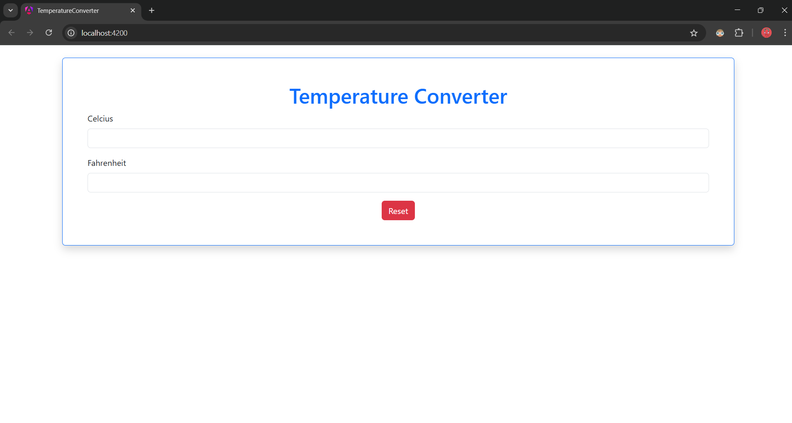
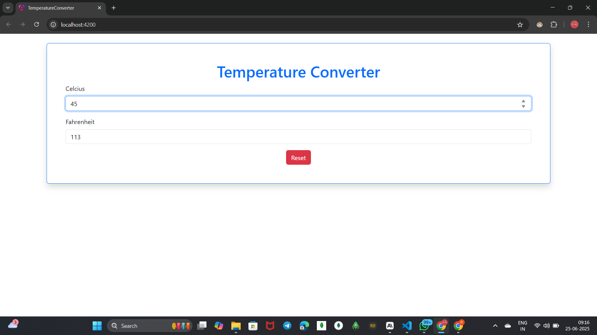

# Temperature Converter

A simple Angular application for converting temperatures between Celsius and Fahrenheit. This project provides real-time temperature conversion with an intuitive user interface.
## Screenshot
 

 

## Features

- **Real-time Conversion**: Convert temperatures instantly as you type
- **Bidirectional Conversion**: Convert from Celsius to Fahrenheit and vice versa
- **Decimal Precision**: Displays results with up to 1 decimal place
- **Responsive Design**: Works seamlessly across different screen sizes
- **Angular Framework**: Built with Angular 20.0.3 for modern web development

## Conversion Formula

- **Celsius to Fahrenheit**: F = C × 9/5 + 32
- **Fahrenheit to Celsius**: C = (F - 32) × 5/9

## Prerequisites

Before you begin, ensure you have the following installed:
- [Node.js](https://nodejs.org/) (version 18 or higher)
- [npm](https://www.npmjs.com/) (comes with Node.js)
- [Angular CLI](https://angular.io/cli) (version 20.0.3 or compatible)

## Installation

1. **Clone the repository**
   ```bash
   git clone https://github.com/prathameshkaratkar/Temperature-Converter.git
   cd Temperature-Converter
   ```

2. **Install dependencies**
   ```bash
   npm install
   ```

## Usage

### Development Server

To start the development server:

```bash
ng serve
```

Navigate to `http://localhost:4200/` in your browser. The application will automatically reload when you make changes to the source files.

### Building the Project

To build the project for production:

```bash
ng build
```

The build artifacts will be stored in the `dist/` directory. The production build is optimized for performance and speed.

## How to Use the Application

1. **Enter a temperature value** in either the Celsius or Fahrenheit input field
2. **Watch the conversion** happen automatically in the other field
3. **Decimal values** are supported and will be displayed with 1 decimal precision
4. **Clear functionality** allows you to reset both fields

## Project Structure

```
Temperature-Converter/
├── src/
│   ├── app/
│   │   ├── components/
│   │   │   └── temperature-converter/
│   │   ├── app.component.ts
│   │   ├── app.component.html
│   │   ├── app.component.css
│   │   └── app.module.ts
│   ├── assets/
│   ├── environments/
│   └── index.html
├── angular.json
├── package.json
├── tsconfig.json
└── README.md
```

## Angular CLI Commands

### Code Scaffolding

Generate a new component:
```bash
ng generate component component-name
```

For a complete list of available schematics:
```bash
ng generate --help
```

### Testing

Run unit tests:
```bash
ng test
```

Run end-to-end tests:
```bash
ng e2e
```

## Technologies Used

- **Angular**: Frontend framework (v20.0.3)
- **TypeScript**: Programming language
- **HTML5**: Markup language
- **CSS3**: Styling
- **Angular CLI**: Command line interface for Angular
- **Karma**: Test runner for unit tests

## Browser Support

This application supports all modern browsers including:
- Chrome (latest)
- Firefox (latest)
- Safari (latest)
- Edge (latest)

## Contributing

1. Fork the repository
2. Create your feature branch (`git checkout -b feature/AmazingFeature`)
3. Commit your changes (`git commit -m 'Add some AmazingFeature'`)
4. Push to the branch (`git push origin feature/AmazingFeature`)
5. Open a Pull Request


## Author

**Prathamesh Karatkar**
- GitHub: [@prathameshkaratkar](https://github.com/prathameshkaratkar)

## Acknowledgments

- Angular team for the excellent framework
- HackerRank for the project inspiration
- Contributors and testers


**Happy Converting! 🌡️**